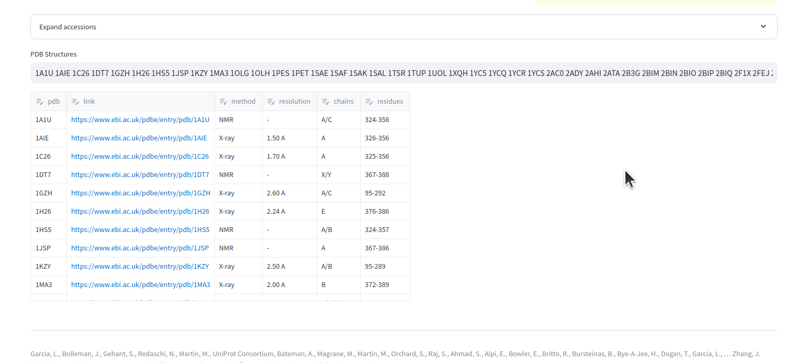
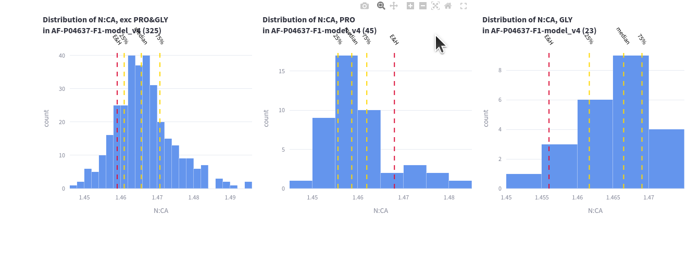

# Prometry Web Application

The [prometry web application](https://prometry.streamlit.app/) provides a basic interface onto the prometry python library to enable 
manual exploration of correlations, contacts etc.  A more sophisticated interaction would 
require coding, ie exploration of a large number of pdbs would be time consuming and 
not approriate for a freely-hosted web app.

In addition there is the ability to search the EBI for solved structures based on gene 
and organism in order to make it easier to run the library on structures of interest.

This is particularly helpful for finding AlphaFold structures that do not 
adhere to stereochemical expectations 😅

The functionality provided in this app is:

## Structure Search
A quick way to find relevant structures using the Uniprot api calls. The AlphaFold 
structures both reviewed and unreviewed are given first, followed by the solved structures and 
some relevant info. These pdb codes can be used further in the app.  

## Correlation
This is the main use of the app, to visualise correlations. 
Using some of the TP53 structures above:  
`9C5S 3D06 5MHC 8UQR 6GGC 6SHZ 4MZI 6GGE 3LW1 5O1E 6RL3 8E7A`

## Contact Maps
A CA-CA contact map for the same TP53 structures, with the hue of both the CA distance 
and the amino acid. The distance is restriained to between 0.5 and 15Å.  

.

## 3d Space
For looking at the atoms of a structure in 3d space the AlphaFold structures can be more 
fun, so this is the TP53 structure [AF-P04637-F1-model_v4](https://alphafold.ebi.ac.uk/entry/P04637)  
  
The bfactor is the plDDT in AlphaFold and the higher the more confident.  AlphaFold structures 
have the feature of wiggly uncertain bits with a more certain core - aka there are 
solved structures in the centre to learn from.  
This is interactive on the prometry app, you can move it about, zoom in and out etc...

## Validation
Speaking of fun AlphaFold structures, the Ramachandran plots are interesting.  
The **Validation** page shows either the distribution of bond lengths for some of the key
distances in the backbone, or overlays on an accpepted Ramachandran grid - 
these plots for the same TP53 AlphaFold structure:  

  

  

## Criteria
The real reason for playing with geometry, is to be able to search for purportedly similar 
features to examine the experimental evidence. Examples of interest include hydrogen bonds, 
disulfide bonds and metal interactions. Below I look at the contacts between SG atoms 
from the TP53 structures again `9C5S 3D06 5MHC 8UQR 6GGC 6SHZ 4MZI 6GGE 3LW1 5O1E 6RL3 8E7A`  

The plot shows the relationship between each SG and the nearest SG to it against the next-nearest. 
That is those SG atoms in the very bottom left corner have 2 close SG contacts. 
Note that this performs a space search and returns nearest on the given criteria, 
optionally with constraints applied.  

  

Note for this document I choose to display the results as an image but I have a dataframe 
of results so I can use this to filter the obervations I want to use for further analysis.  

---  

The application is hosted for free by streamlit and a certain amount of fair use 
is assumed.

---  
