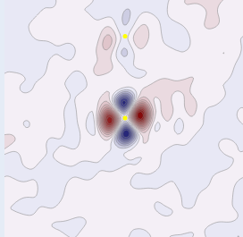
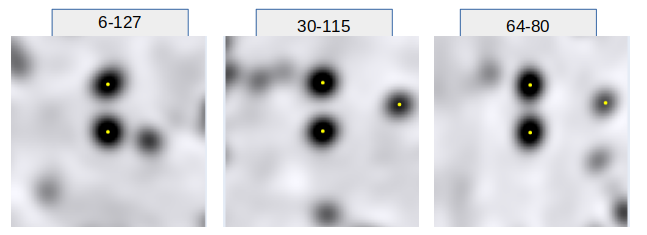

# Density
The file format used in this study is the [ccp4 file format](https://en.wikipedia.org/wiki/CCP4_(file_format)) 
which is industry standard for X-ray crystallogtraphy and Cryo-electron microscopy.

The format is that of a 3d grid of voxels, each with a value corresponding to 
density of electrons. The file is in a binary format, with a predefines set of headers 
with information before the voxel information, the format is described 
here [MAPLIB](https://www.ccp4.ac.uk/html/maplib.html#description).

The crystal space is not necessarily orthogonal and needs to be mapped onto real space.  

## Information lost with information gained
Before we explore the incredible detail of subatomic electron density measurements we should 
take a moment to consider that information gained can coincide with information lost.  

With the accuracy that we now have to identify the individual atoms in the 
electron density by the strength of the density, we lose the average density over a range 
which means we lose information about secondary structure. We can regain it, but it is not 
quite the same as the information we previously had.  

As an example below we have the projections of the density of the atoms of 2 structures:  
- 1ejg, as often used here because of the 3 disulfide bodns that are so distinctive, and its 
ultrahigh solution at 0.54Å giving it samples as frequently as 0.18Å (Jelsch et al, 2000).  
- 6q53, solved at 3.70Å (Leiger et al, 2019).  

  

On the first row - for 1ejg - you can see the sulfur atoms very clearly, and the distance 
between them suggests they are disulfide bonds. If you look at the ribbon structure from 
the 3d visualisation in the ebi that is on the xy plane you see that there are 2 
prominent helices that are not identifiable.  

On the otherhand, the low resolution structure 6q53 has clearly visible helices in the atoms 
of the electron density that directly match up to the helices that can be seen in the ebi 
3d visualisation. We can identify the secondary structures in otherways, but this loss is notable.  

## Secondary structure and density
We expect the density to be higher (and the bfactor lower) in secondary structures 
within the protein because the atoms are "moving" less, they are in an ordered position. 
Where the atoms are less stable and may "move" more (aka the position is more 
varied so the average is spread out) the density is lower and the bfactor is higher. 
With high resolution structures, as well as the average position we also have the 
literal number of electrons to take into account, ie sulfur has a much higher 
electron density than hydrogen. 

## Artefacts and uncertainty - rings
Because we can measure things in ultra-high resolution structures that are much finer, 
we need to be careful about artefacts. There is a particular artefact in ultra-high 
resolution structures that is particularly problematic - the ring artefact.  

This is known from Afonine (2004) and yet somehow has never been fully taken on board - 
paper after paper continues to make inferences based on potential artefacts highlighted 
in that paper (see my literature review).  

In summary, during conversion between various fourier sequences, an infinite sequence has 
to be cut off. The impact of the cutoff is resolution dependent, and it just so happens 
that in ultrahigh solutions the impact is at about 0.6Å - midway in a bond. It is the 
information in bonds that are of particular interest in ultra-high structures, with many 
papers purporting to be able to "see" bond electrons, so ...  

For ejg I have each of the disulfide bonds below (O on the plane), with the density 
increased and using a heatmap with 200 samples to improve focus. 
The SG atoms are stronger in density so the effect is most pronounced with them, 
but you can see that the ring effect is prevalent. 

I would be concerned about making too many inferences about anything on the rings.  
The value of the rings is roughly similar in magnitude to what we could be looking 
for in terms of bond electrons.

## Difference density
According to Afonine (2004) the problem with the rings goes away with difference density 
where the rings are "balanced". I am suspicious of this and of difference density in general 
but include it here for completeness.  

I say I am suspicious and then produce a textbook perfect image of difference density. 
This shows the SG atom in CYS residue 3, in plane with its O and the disulfide bond 
with residue 40.  It shows that the density in the model is not the observed density, 
so we are drawn to make inferences about reality by seeing how reality differs from 
expectations. If expectations had been a spherical atom model with even density around 
the sulfur atom, we are seeing that in fact the electrons are distributed in a more lobe 
like effect. I am not convinced, to me this is far too sensitive to the model, 
which was made up in the first place.  

There is some element of luck in the plane chosen - this can be explored in 3d on the associated colab page.  

## EM Potential
So, I don't like the rings and I don't like difference density: happily we can explore an 
entirely different solution to structures which do not have these features in em structures. 
They have neither the ring artefacts as the solution does not involve these fourier transforms, 
nor the difference density as the solution is direct and does not require the iteration to a model. 

It would be reasonable to assume that if there are any real features in the bonds 
observable at ultrahigh resolution, they would be observale in electron crystallography too.  

The structure 7uly is solved by electron crystallography at 0.87Å and has 129 residues. 
There are 4 disulfide bonds so I will do the same analysis as for 1ejg with the first 3:

  

You can see that the density is very different in character - let's look at some peptide bonds.  

  

There is some clarity in the images and distinctly changing nature between the bonds as 
we would hope, with a changing nature in electron dstribution between C:N+1 and O - 
my particular interest.

## Neighbours
The final example on the colab page shows that neighbours can be added to interactive plots like plotly easily, so when you waive the mouse over the plot you can identify the atoms. More advanced programmatic use can be made of this, and it can be quite computationally intense as it is not well optimised and performs a pretty full search.

---  

## Colab Page to replicate
All the plots can be run from the colab example found here: 
[colab-maps-density](https://github.com/rae-gh/colab-analyses/blob/main/Maps/Density.ipynb)

