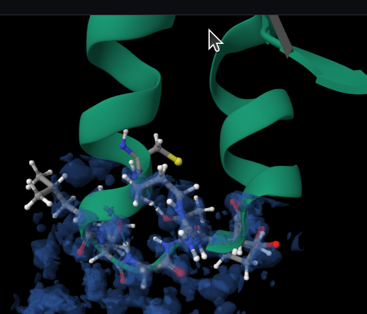
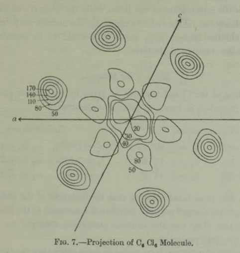
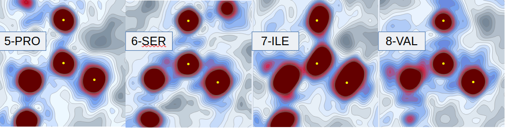

# Electron Density Maps

The primary purpose of my PhD is to look for new information about inter-atomic bonds from ultra-high resolution x-ray crystallographic maps. The explosion in the solutions of ultra-high resolution structures has led to information about protein crystal structures being sampled up to every 0.3Å in ultra-high structures.  

## Mesh-like electron density
Traditional electron density is visualised in applications like [ChimeraX](https://www.cgl.ucsf.edu/chimerax/), [proteopedia](http://www.bioinformatics.org/molvis/edm/) or at the respositories like [EBI](https://www.ebi.ac.uk/pdbe/entry/pdb/1ejg/index) as mesh-type structures based on standard deviatons.

  

This image is purposefully annoying - you can see the electron density doesn't cover the structure. 
All the deposited electron density at the EBI has been slowly changed over the past couple of years to be 
unit cell instead of structure coverage. It has broken lots of courses and it was a lot of work for me 
but my electron density applications were updated to take this into account.

## Probability contour electron density
An example of the early sketches of electron density can be seen in Kathleen Lonsdale's solution to 
Hexachlorobenzene (Lonsdale, 1931).  

## Maxima and electron density
When experimental evidence for atom position is discussed, there is consensus that the 
experimental evidence **means** density peaks. According to Wlodawer (2007) the electron density is the final arbiter.  

What does this really mean? There is no consensus on what the statistical variation or movement variation 
means wrt atom position as experimental evidence. Stereo-chemical restraints are applied to force 
atom positions into line, but not necessarily with explanation or record as to deviation from evidence.  

The technique I have used to analyse electron density (and Cryo-EM and Electron Crystallography potential) 
is numerical such that I can normalise and supeorpose. I use the raw values in the electron density to interpolate, 
visualise and differentiate.

This leads to probability density and contour maps more similar to those of Kathleen Lonsdale than ChimeraX. 
In this image I have taken visualisations of peptide bonds from crambin, the same structure as above from the ebi mesh. 
I have chosen to display 4 peptide bonds in a row to show the changing nature of them, and I have annotated over the top of the images.

## 3 points for a plane
The yellow dots on the images above are the points that I have taken to define the plane. 
In this case they are specific points in the structure that I have chosen to put all the images in the same alignment:
- C in the centre
- CA linear, that is vertivally above the C
- O on the plane, wherever it needs to be, it swivels up onto the right hand side.

This forces those atoms onto the plane, I could have chosen N+1 instead, 
although it is pretty much expected to be on the plane and we can measure where it is not 
(see geometry library).  

In the depth image coming up, I choose n samples either side of the plane.  

The choice of atom position is arbitrary in some sense, and I can also adjust to the closest maxima for alignment. 
This is a form of image registration, where I am choosing the maxima to align the image, 
I could (and might) make a volumetric decision instead for alignment, or some other method.  

You can perhaps see, and could if you played with the volume slider on the web app, 
that the atom positions are not necessarily quite at the density maxima.

Mathematically speaking, the alignment is done by finding a transformation for the given plane
to the the origin and the xy plane, and using that transformation for all points. 
Once found, this transformation can be used to manipulate through space moving orthoginally. 
This feature is used in the web-app to navigate around.  

## 3d slices
Although I like the planar slices for their clarity, you cannot be quite sure without 
inspection what you are seeing, so the 3d slices add further clarity. Taking one of the peptide bonds above:
  

I do find this quite hard to understand and navigate so prefer my ability to navigate around 
the planar slices in my web-app.

---  

## Colab Page to replicate
All the plots can be run from the colab example found here: 
[colab-maps-intro](https://github.com/rae-gh/colab-analyses/blob/main/Density_Intro.ipynb)