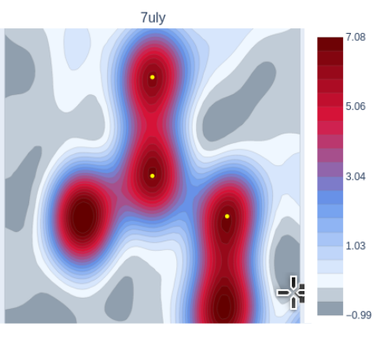

# Python library `maptial`

All python libraries have been tied up together in a single library called `maptial` 
for protein density maps spatial and geometric analysis.  This combines the geometric 
parameters for correlation with density analysis and is installable from pypi:

## Installation

```bash
pip install maptial
```

## Documentation  

The code is [available on GitHub](https://github.com/rae-gh/lib-maptial)  

The documentation is automatically generated from the code 
[docstrings by PyDoctor](https://rae-gh.github.io/lib-maptial/)  

Examples of using the library for results can be found in jupyter notebooks that can be 
opened on google-colab on GitHub [colab-analyses](https://github.com/rae-gh/colab-analyses)  

## An example

An example below shows the call to find a slice of density inside a protein structure 
by requesting a plane containing 3 specified atoms from the pdb structure. 
The resulting 2d slice of density numbers is passed to a helper function for plotting.  

The points used to define the plane are plotted as yellow dots, and the resulting image 
is a contour plot with predefined colours. The 2dmatrix can be plotted however you like, 
the helper functions use predefined settings based on analysis and personal preference. 
This colour scheme has greys below 0, and is designed to pick out atoms in red and increasing 
density towards the atoms in blue->red.  

This example puts the carbonyl atom of the 5th residue at the centre of the plane, 
with the CA carbon atom of the same residue linearly above it. It puts onto the plane the 
N atom of the 6th residue, so it is showing the peptide bond between the 5th and 6th residues.  

The library takes spatial coordinates for the plane definitions, and contains helper 
functions to translate pdb atom positions into spatial coordinates.  
Here, the atoms have been defined by `chain:residue@atom.version`.  

```python
from maptial.xyz import vectorthree as v3
import maptial.map.mapsmanager as mman
import maptial.map.mapfunctions as mfun
import maptial.map.mapplothelp as mph

DATADIR = "sample_data/" # the pdb and ccp4 files are downloaded here
pdb_code = "7uly"
central_atom = "A:5@C.A"
linear_atom = "A:5@CA.A"
planar_atom = "A:6@N.A"
interpolation = "bspline"
width = 4.5 # Angstrom
samples = 50 # More samples is sharper but slower
derivative = 0 # 0 for density, 1 2 for 1st and 2nd derivative 3 for critical points

mman.MapsManager().set_dir(DATADIR)
ml = mman.MapsManager().get_or_create(pdb_code,file=1,header=1,values=1)
mf = mfun.MapFunctions(pdb_code,ml.mobj,ml.pobj,interpolation)
slice_vectors = []

cc = v3.VectorThree().from_coords(ml.pobj.get_coords_key(central_atom))
ll = v3.VectorThree().from_coords(ml.pobj.get_coords_key(linear_atom))
pp = v3.VectorThree().from_coords(ml.pobj.get_coords_key(planar_atom))
slice_vectors.append((cc,ll,pp))  

filename = "SHOW" # if a filename is specified with .html it will be saved instead of shown
vals2d = mf.get_slice(cc,ll,pp,width,samples,interpolation,deriv=derivative,ret_type="2d")
mplot = mph.MapPlotHelp(filename)
mplot.make_plot_slice_2d(vals2d,min_percent=1,max_percent=0.9,samples=samples,width=width,points=[cc,ll,pp],title=pdb_code)
```
Resulting image:  



